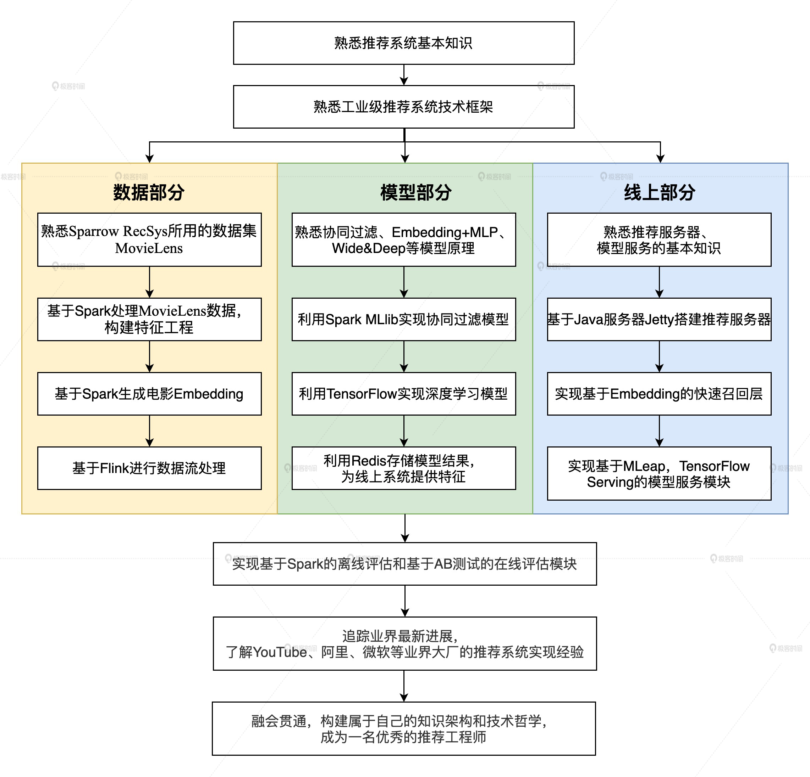
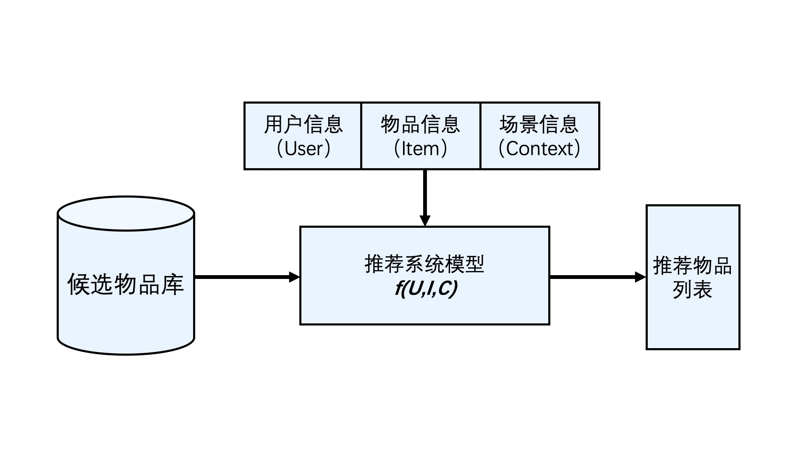

## 深度学习推荐系统实战笔记

### 整体框架

### 推荐系统经典架构长啥样

1. 推荐系统要解决的问题

   在“信息过载”的情况下，用户如何高效获取感兴趣的信息。

   推荐系统要被处理的问题可以被形式化定义为：**对于某个用户U（User），在特定场景C（Context）下，针对海量的“物品”信息构建一个函数 ，预测用户对特定候选物品I（Item）的喜好程度，再根据喜好程度对所有候选物品进行排序，生成推荐列表的问题。**

   

2. 推荐系统逻辑架构

   

3. 推荐系统中着重需要解决的两类问题

   （1） 一类问题与数据和信息相关，即“用户信息”“物品信息”“场景信息”分别是什么？如何存储、更新和处理数据？

   （2） 另一类问题与推荐系统算法和模型相关，即推荐系统模型如何训练、预测，以及如何达成更好的推荐效果？

   

4. 工业级推荐系统的技术架构

   （1） “数据和信息”部分逐渐发展为推荐系统中融合了数据离线批处理、实时流处理的数据流框架；

   （2） “算法和模型”部分进一步细化为推荐系统中，集训练、评估、部署、线上推断为一体的模型框架。

   

   

5. 大数据平台加工后的数据出口

   （1）生成推荐系统模型所需的样本数据，用于算法模型的训练和评估；

   （2）生成推荐系统模型服务（Model Serving）所需的“用户特征”，“物品特征”和一部分“场景特征”，用于推荐系统的线上推断。

   （3）生成系统监控，商业智能系统所需的统计型数据。

   

6. 深度学习对推荐系统模型的典型应用

   （1）深度学习中 Embedding 技术在召回层的应用。作为深度学习中非常核心的 Embedding 技术，将它应用在推荐系统的召回层中，做相关物品的快速召回，已经是业界非常主流的解决方案了。

   （2）不同结构的深度学习模型在排序层的应用。排序层（也称精排层）是影响推荐效果的重中之重，也是深度学习模型大展拳脚的领域。深度学习模型的灵活性高，表达能力强的特点，这让它非常适合于大数据量下的精确排序。深度学习排序模型毫无疑问是业界和学界都在不断加大投入，快速迭代的部分。

   （3）增强学习在模型更新、工程模型一体化方向上的应用。增强学习可以说是与深度学习密切相关的另一机器学习领域，它在推荐系统中的应用，让推荐系统可以在实时性层面更上一层楼。

### 推荐系统特征工程

1. 