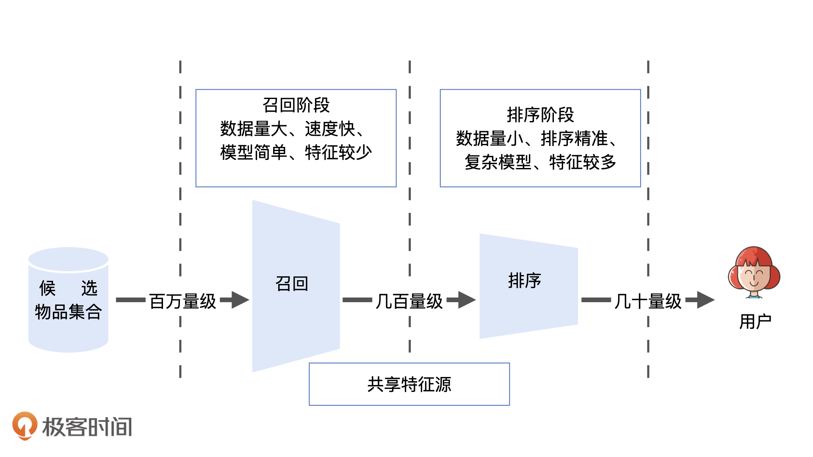
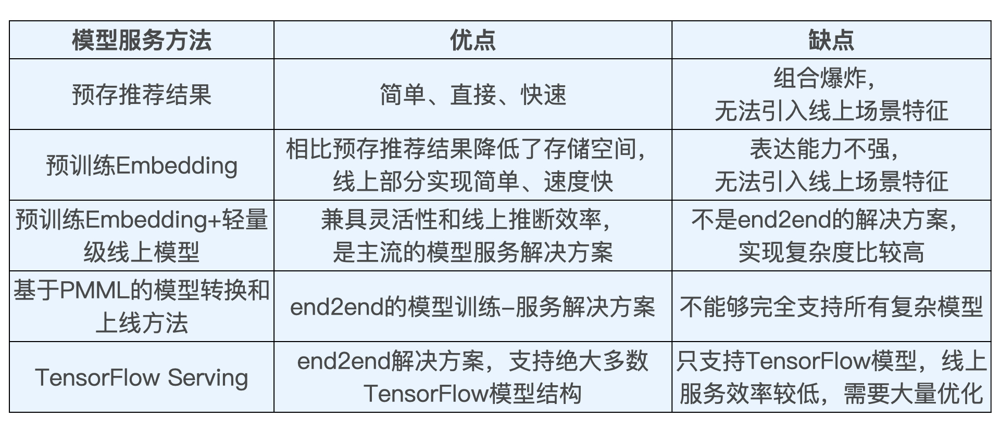

## 深度学习推荐系统实战笔记

### 整体框架


### 推荐系统经典架构长啥样

1. 推荐系统要解决的问题

   在“信息过载”的情况下，用户如何高效获取感兴趣的信息。

   推荐系统要被处理的问题可以被形式化定义为：**对于某个用户U（User），在特定场景C（Context）下，针对海量的“物品”信息构建一个函数 ，预测用户对特定候选物品I（Item）的喜好程度，再根据喜好程度对所有候选物品进行排序，生成推荐列表的问题。**

   

2. 推荐系统逻辑架构

   

3. 推荐系统中着重需要解决的两类问题

   （1） 一类问题与数据和信息相关，即“用户信息”“物品信息”“场景信息”分别是什么？如何存储、更新和处理数据？

   （2） 另一类问题与推荐系统算法和模型相关，即推荐系统模型如何训练、预测，以及如何达成更好的推荐效果？

   

4. 工业级推荐系统的技术架构

   （1） “数据和信息”部分逐渐发展为推荐系统中融合了数据离线批处理、实时流处理的数据流框架；

   （2） “算法和模型”部分进一步细化为推荐系统中，集训练、评估、部署、线上推断为一体的模型框架。

   

   

5. 大数据平台加工后的数据出口

   （1）生成推荐系统模型所需的样本数据，用于算法模型的训练和评估；

   （2）生成推荐系统模型服务（Model Serving）所需的“用户特征”，“物品特征”和一部分“场景特征”，用于推荐系统的线上推断。

   （3）生成系统监控，商业智能系统所需的统计型数据。

   

6. 深度学习对推荐系统模型的典型应用

   （1）深度学习中 Embedding 技术在召回层的应用。作为深度学习中非常核心的 Embedding 技术，将它应用在推荐系统的召回层中，做相关物品的快速召回，已经是业界非常主流的解决方案了。

   （2）不同结构的深度学习模型在排序层的应用。排序层（也称精排层）是影响推荐效果的重中之重，也是深度学习模型大展拳脚的领域。深度学习模型的灵活性高，表达能力强的特点，这让它非常适合于大数据量下的精确排序。深度学习排序模型毫无疑问是业界和学界都在不断加大投入，快速迭代的部分。

   （3）增强学习在模型更新、工程模型一体化方向上的应用。增强学习可以说是与深度学习密切相关的另一机器学习领域，它在推荐系统中的应用，让推荐系统可以在实时性层面更上一层楼。


### 推荐系统特征工程

1. 什么是特征工程

   推荐系统就是利用“用户信息”，“物品信息”，“场景信息”这三大部分有价值数据，通过构建推荐模型得出推荐列表的工程系统。特征工程就是利用工程手段从以上信息中提取的过程。特征工程的原则：**尽可能地让特征工程抽取出的一组特征，能够保留推荐环境及用户行为过程中的所有“有用“信息，并且尽量摒弃冗余信息。**

   

2. 推荐系统中的常用特征

   （1）用户行为数据。用户的潜在兴趣、用户对物品的真实评价都包含在用户的行为历史中。用户行为在推荐系统中一般分为显性反馈行为（Explicit Feedback）和隐性反馈行为（Implicit Feedback）两种。在当前的推荐系统特征工程中，隐性反馈行为越来越重要，主要原因是显性反馈行为的收集难度过大，数据量小。所以，能够反映用户行为特点的隐性反馈是目前特征挖掘的重点。

   

   （2）用户关系数据。互联网本质上就是人与人、人与信息之间的连接。如果说用户行为数据是人与物之间的“连接”日志，那么用户关系数据就是人与人之间连接的记录。用户关系数据也可以分为“显性”和“隐性”两种，或者称为“强关系”和“弱关系”。用户与用户之间可以通过“关注”“好友关系”等连接建立“强关系”，也可以通过“互相点赞”“同处一个社区”，甚至“同看一部电影”建立“弱关系”。

   （3）属性、标签类数据。它们本质上都是直接描述用户或者物品的特征。属性和标签的主体可以是用户，也可以是物品。它们的来源非常多样，大体上包含以下几类。

   

   （4）内容类数据。内容类数据可以看作属性标签型特征的延伸，同样是描述物品或用户的数据，但相比标签类特征，内容类数据往往是大段的描述型文字、图片，甚至视频。

   （5）场景信息（上下文信息）。它是描述推荐行为产生的场景的信息。最常用的上下文信息是“时间”和通过 GPS、IP 地址获得的“地点”信息。在实际的推荐系统应用中，我们更多还是利用时间、地点、推荐页面这些易获取的场景特征。


### Spark解决特征处理

1. 类别型特征处理

   我们进行特征处理的目的，是把所有的特征全部转换成一个数值型的特征向量，对于数值型特征，这个过程非常简单，直接把这个数值放到特征向量上相应的维度上就可以了。但是对于类别、ID 类特征，这里我们就要用到 One-hot 编码（也被称为独热编码），它是将类别、ID 型特征转换成数值向量的一种最典型的编码方式。它通过把所有其他维度置为 0，单独将当前类别或者 ID 对应的维度置为 1 的方式生成特征向量。

   Spark使用机器学习库MLlib来完成One-hot特征的处理。最主要的步骤是，我们先创建一个负责 One-hot 编码的转换器，OneHotEncoderEstimator，然后通过它的 fit 函数完成指定特征的预处理，并利用 transform 函数将原始特征转换成 One-hot 特征。实现代码如下：

   ```scala
   
   def oneHotEncoderExample(samples:DataFrame): Unit ={
     //samples样本集中的每一条数据代表一部电影的信息，其中movieId为电影id
     val samplesWithIdNumber = samples.withColumn("movieIdNumber", col("movieId").cast(sql.types.IntegerType))
   
   
     //利用Spark的机器学习库Spark MLlib创建One-hot编码器
     val oneHotEncoder = new OneHotEncoderEstimator()
       .setInputCols(Array("movieIdNumber"))
       .setOutputCols(Array("movieIdVector"))
       .setDropLast(false)
   
   
     //训练One-hot编码器，并完成从id特征到One-hot向量的转换
     val oneHotEncoderSamples = oneHotEncoder.fit(samplesWithIdNumber).transform(samplesWithIdNumber)
     //打印最终样本的数据结构
     oneHotEncoderSamples.printSchema()
     //打印10条样本查看结果
     oneHotEncoderSamples.show(10)
   
   _（参考 com.wzhe.sparrowrecsys.offline.spark.featureeng.FeatureEngineering__中的oneHotEncoderExample函数）_
   ```

   针对多标签特征来说，转变为对应的Multi-Hot编码（多热编码）即可。

   

2. 数值型特征处理

   数值型的特征存在两方面问题，一是特征的尺度，一是特征的分布。

   特征尺度易于理解。比如电影推荐中评价次数fr和平均评分fs这两个特征，评价次数理论上是一个数值无上限的特征，而对评分来说，由于采取五分制，所以取值范围在[0,5]之间。由于 fr 和 fs 两个特征的尺度差距太大，如果我们把特征的原始数值直接输入推荐模型，就会导致这两个特征对于模型的影响程度有显著的区别。如果模型中未做特殊处理的话，fr 这个特征由于波动范围高出 fs 几个量级，可能会完全掩盖 fs 作用，这当然是我们不愿意看到的。为此我们希望把两个特征的尺度拉平到一个区域内，通常是[0,1]范围，这就是所谓归一化。

   归一化虽然能够解决特征取值范围不统一的问题，但无法改变特征值的分布。比如电影评分中，大量集中在3.5分附近，越靠近3.5分密度越大。这对于模型学习来说也不是一个好的现象，因为特征的区分度并不高。我们经常会用**分桶（Bucketing）**的方式来解决特征值分布极不均匀的问题。所谓“分桶”，就是将样本按照某特征的值从高到低排序，然后按照桶的数量找到分位数，将样本分到各自的桶中，再用桶 ID 作为特征值。

   在 Spark MLlib 中，分别提供了两个转换器 MinMaxScaler 和 QuantileDiscretizer，来进行归一化和分桶的特征处理。它们的使用方法和之前介绍的 OneHotEncoderEstimator 一样，都是先用 fit 函数进行数据预处理，再用 transform 函数完成特征转换。下面代码利用这两个转换器完成特征归一化和分桶的过程。

   ```scala
   
   def ratingFeatures(samples:DataFrame): Unit ={
     samples.printSchema()
     samples.show(10)
   
   
     //利用打分表ratings计算电影的平均分、被打分次数等数值型特征
     val movieFeatures = samples.groupBy(col("movieId"))
       .agg(count(lit(1)).as("ratingCount"),
         avg(col("rating")).as("avgRating"),
         variance(col("rating")).as("ratingVar"))
         .withColumn("avgRatingVec", double2vec(col("avgRating")))
   
   
     movieFeatures.show(10)
   
   
     //分桶处理，创建QuantileDiscretizer进行分桶，将打分次数这一特征分到100个桶中
     val ratingCountDiscretizer = new QuantileDiscretizer()
       .setInputCol("ratingCount")
       .setOutputCol("ratingCountBucket")
       .setNumBuckets(100)
   
   
     //归一化处理，创建MinMaxScaler进行归一化，将平均得分进行归一化
     val ratingScaler = new MinMaxScaler()
       .setInputCol("avgRatingVec")
       .setOutputCol("scaleAvgRating")
   
   
     //创建一个pipeline，依次执行两个特征处理过程
     val pipelineStage: Array[PipelineStage] = Array(ratingCountDiscretizer, ratingScaler)
     val featurePipeline = new Pipeline().setStages(pipelineStage)
   
   
     val movieProcessedFeatures = featurePipeline.fit(movieFeatures).transform(movieFeatures)
     //打印最终结果
     movieProcessedFeatures.show(10)
   
   _（参考 com.wzhe.sparrowrecsys.offline.spark.featureeng.FeatureEngineering中的ratingFeatures函数）_
   ```

   

3. 特征处理总结

   特征处理没有固定模式，上面列的只是一些常见处理方法，在实际应用中，我们需要多种尝试，找到最能提升模型效果的处理方式。


4. Spark中几个常用正则归一化函数

   ```tex
   Normalizer: 计算p范数，然后该样本中每个元素除以该范数。l1: 每个样本中每个元素绝对值的和，l2: 每个样本中每个元素的平方和开根号，lp: 每个样本中每个元素的p次方和的p次根，默认用l2范数。
   
   StandardScaler: 数据标准化，(xi - u) / σ 【u:均值，σ：方差】当数据(x)按均值(μ)中心化后，再按标准差(σ)缩放，数据就会服从为均值为0，方差为1的正态分布（即标准正态分布）。
   
   RobustScaler: (xi - median) / IQR 【median是样本的中位数，IQR是样本的 四分位距：根据第1个四分位数和第3个四分位数之间的范围来缩放数据】。
   
   MinMaxScaler: 数据归一化，(xi - min(x)) / (max(x) - min(x)) ;当数据(x)按照最小值中心化后，再按极差（最大值 - 最小值）缩放，数据移动了最小值个单位，并且会被收敛到 [0,1]之间。
   ```


### 推荐系统中的Embedding技术

1. embedding在特征工程中的作用

   （1）Embedding是处理稀疏特征的利器。因为推荐场景中的类别、ID 型特征非常多，大量使用 One-hot 编码会导致样本特征向量极度稀疏，而深度学习的结构特点又不利于稀疏特征向量的处理，因此几乎所有深度学习推荐模型都会由 Embedding 层负责将稀疏高维特征向量转换成稠密低维特征向量。

   （2）Embedding 可以融合大量有价值信息，本身就是极其重要的特征向量。相比由原始信息直接处理得来的特征向量，Embedding 的表达能力更强，特别是 Graph Embedding 技术被提出后，Embedding 几乎可以引入任何信息进行编码，使其本身就包含大量有价值的信息，所以通过预训练得到的 Embedding 向量本身就是极其重要的特征向量。

   

2. Word2vec模型结构

   Word2vec模型本质上是一个三层的神经网络。如下图所示。

   

   它的输入层和输出层的维度都是 V，这个 V 其实就是语料库词典的大小。假设语料库一共使用了 10000 个词，那么 V 就等于 10000。这里的输入向量自然就是由输入词转换而来的 One-hot 编码向量，输出向量则是由多个输出词转换而来的 Multi-hot 编码向量，显然，基于 Skip-gram 框架的 Word2vec 模型解决的是一个多分类问题。输入向量矩阵 WVxN 的每一个行向量对应的就是我们要找的“词向量”。


### Graph Embedding和Embedding应用

1. DeepWalk

   我们基于原始的用户行为序列来构建物品关系图，然后采用随机游走的方式随机选择起始点，重新产生物品序列，最后将这些随机游走生成的物品序列输入 Word2vec 模型，生成最终的物品 Embedding 向量。

   

2. Node2Vec

   Node2vec 相比于 Deep Walk，增加了随机游走过程中跳转概率的倾向性。如果倾向于宽度优先搜索，则 Embedding 结果更加体现“结构性”。如果倾向于深度优先搜索，则更加体现“同质性”。

   

3. Embedding应用于推荐系统的特征工程中

   Embedding在推荐系统中应用方式主要有三种，分别是直接应用、预训练应用和End2End应用。

   “直接应用”是直接利用Embedding向量的相似性实现某些推荐系统的功能。典型功能有，利用物品Embedding间的相似性实现相似物品推荐，利用物品Embedding和用户Embedding的相似性实现“猜你喜欢”等经典推荐功能，还可以利用物品Embedding实现推荐系统中的召回层等。

   “预训练应用”指的是在我们预先训练好物品和用户的Embedding之后，不直接应用，而是把这些Embedding向量作为特征向量的一部分，跟其余的特征向量拼接起来，作为推荐模型的输入参与训练。这样做能够更好的把其他特征引入进来，让推荐模型做出更为全面切准确的预测。

   “End2End应用”也就是端对端训练，是指把Embedding的训练和深度学习推荐模型结合起来，采用统一的、端对端的方式一起训练，直接得到包含Embedding层的推荐模型。这种方式非常流行，比如下图就展示了三个包含 Embedding 层的经典模型，分别是微软的 Deep Crossing，UCL 提出的 FNN 和 Google 的 Wide&Deep。

   

   

4. Embedding预训练和End2End两种方式的优缺点。

   Embedding预训练的优点：1.更快。因为对于End2End的方式，Embedding层的优化还受推荐算法的影响，这会增加计算量。2.难收敛。推荐算法是以Embedding为前提的，在端到端的方式中，embedding层包含大量参数，可能无法有效收敛。
   Embedding端到端的优点：可能收敛到更好的结果。端到端因为将Embedding和推荐算法连接起来训练，那么Embedding层可以学习到最有利于推荐目标的Embedding结果。

   

### Spark生成Item2vec和Graph Embedding

1. spark生成Item2vec

   ```scala
   def trainItem2vec(samples : RDD[Seq[String]]): Unit ={
       //设置模型参数(向量维度、滑动窗口大小和训练迭代次数)
       val word2vec = new Word2Vec()
       .setVectorSize(10)
       .setWindowSize(5)
       .setNumIterations(10)
   
   
     //训练模型
     val model = word2vec.fit(samples)
   
   
     //训练结束，用模型查找与item"592"最相似的20个item
     val synonyms = model.findSynonyms("592", 20)
     for((synonym, cosineSimilarity) <- synonyms) {
       println(s"$synonym $cosineSimilarity")
     }
    
     //保存模型
     val embFolderPath = this.getClass.getResource("/webroot/sampledata/")
     val file = new File(embFolderPath.getPath + "embedding.txt")
     val bw = new BufferedWriter(new FileWriter(file))
     var id = 0
     //用model.getVectors获取所有Embedding向量
     for (movieId <- model.getVectors.keys){
       id+=1
       bw.write( movieId + ":" + model.getVectors(movieId).mkString(" ") + "\n")
     }
     bw.close()
   ```


### 特征工程及深度学习一些问题

1. 对训练数据中的某项特征进行平方或者开方，是为了改变训练数据的分布。训练数据的分布被改变后，训练出来的模型岂不是不能正确拟合训练数据了？

   对训练数据中的某个特征进行开方或者平方操作，本质上是改变了特征的分布，并不是训练数据的分布。特征的分布和训练数据的分布没有本质的联系，只要你不改变训练数据 label 的分布，最终预测出的结果都应该是符合数据本身分布的。因为你要预测的是 label，并不是特征本身。而且在最终的预测过程中，这些开方、平方的特征处理操作是在模型推断过程中复现的，本质上可以看作是模型的一部分，所以不存在改变数据分布的问题。

   

2. 为什么深度学习的结构特点不利于稀疏特征向量的处理呢？

   一方面，如果我们深入到神经网络的梯度下降学习过程就会发现，特征过于稀疏会导致整个网络的收敛非常慢，因为每一个样本的学习只有极少数的权重会得到更新，这在样本数量有限的情况下会导致模型不收敛。另一个方面，One-hot 类稀疏特征的维度往往非常地大，可能会达到千万甚至亿的级别，如果直接连接进入深度学习网络，那整个模型的参数数量会非常庞大，这对于一般公司的算力开销都是吃不消的。

   所以基于上面两个原因，我们往往先通过 Embedding 把原始稀疏特征稠密化，然后再输入复杂的深度学习网络进行训练，这相当于把原始特征向量跟上层复杂深度学习网络做一个隔离。


### 线上提供高并发的推荐服务

1. 高并发推荐服务整体架构

   高并发推荐服务的整体架构主要由三个重要机制支撑，它们分别是负载均衡、缓存、推荐服务降级机制。

   通过增加服务器来分担独立节点的压力，同时合理分配任务，以达到按能力分配和高效率分配的目的，分配任务的机器称之为“负载均衡服务器”。

   缓存是指同一个用户多次请求同样的推荐服务时，可以把第一次请求时的推荐结果缓存起来，后续请求时直接返回缓存中的结果；另外对于新用户，可以按照一些规则预先缓存几类新用户的推荐列表。在一个成熟的工业级推荐系统中，合理的缓存策略甚至能够阻挡掉 90% 以上的推荐请求，大大减小推荐服务器的计算压力。

   服务降级就是抛弃原本的复杂逻辑，采用最保险、最简单、最不消耗资源的降级服务来渡过特殊时期。比如对于推荐服务来说，我们可以抛弃原本的复杂推荐模型，采用基于规则的推荐方法来生成推荐列表，甚至直接在缓存或者内存中提前准备好应对故障时的默认推荐列表，做到“0”计算产出服务结果，这些都是服务降级的可行策略。

   总之，“负载均衡”提升服务能力，“缓存”降低服务压力，“服务降级”机制保证故障时刻的服务不崩溃，压力不传导，这三点可以看成是一个成熟稳定的高并发推荐服务的基石。


### 推荐系统特征的存储

1. SparrowRecsys推荐系统数据存储方式

   该推荐系统中主要包含以下几类特征：

   

   （1）用户特征的总数比较大，它们很难全部载入到服务器内存中，所以我们把用户特征载入到 Redis 之类的内存数据库中是合理的。

   （2）物品特征的总数比较小，而且每次用户请求，一般只会用到一个用户的特征，但为了物品排序，推荐服务器需要访问几乎所有候选物品的特征。针对这个特点，我们完全可以把所有物品特征阶段性地载入到服务器内存中，大大减少 Redis 的线上压力。

   （3）我们还要找一个地方去存储特征历史数据、样本数据等体量比较大，但不要求实时获取的数据。这个时候分布式文件系统（单机环境下以本机文件系统为例）往往是最好的选择，由于类似 HDFS 之类的分布式文件系统具有近乎无限的存储空间，我们可以把每次处理的全量特征，每次训练的 Embedding 全部保存到分布式文件系统中，方便离线评估时使用。

   最终特征存储方式总结如下：

   

   

2. Redis数据库基本知识

   Redis 是当今业界最主流的内存数据库，那在使用它之前，我们应该清楚 Redis 的两个主要特点。

   **一是所有的数据都以 Key-value 的形式存储。** 其中，Key 只能是字符串，value 可支持的数据结构包括 string(字符串)、list(链表)、set(集合)、zset(有序集合) 和 hash(哈希)。这个特点决定了 Redis 的使用方式，无论是存储还是获取，都应该以键值对的形式进行，并且根据你的数据特点，设计值的数据结构。

   **二是所有的数据都存储在内存中，磁盘只在持久化备份或恢复数据时起作用。**这个特点决定了 Redis 的特性，一是 QPS 峰值可以很高，二是数据易丢失，所以我们在维护 Redis 时要充分考虑数据的备份问题，或者说，不应该把关键的业务数据唯一地放到 Redis 中。但对于可恢复，不关乎关键业务逻辑的推荐特征数据，就非常适合利用 Redis 提供高效的存储和查询服务。


### 推荐系统召回和排序层

1. 推荐系统中的召回和排序层作用

   一般推荐系统分为召回和排序层，召回层就是要**快速**、准确地过滤出相关物品，缩小候选集，排序层则要以提升推荐效果为目标，作出精准的推荐列表排序。

   

   

2. 召回层和排序层特点对比

   从候选集规模、模型复杂程度、特征数量、处理速度、排序精度等几个角度来对比召回层和排序层的特点：

   

   

3. 单策略召回

   单策略召回指的是，通过制定一条规则或者利用一个简单模型来快速地召回可能的相关物品。比如推荐电影的时候，我们首先要想到用户可能会喜欢什么电影。按照经验来说，很有可能是这三类，分别是大众口碑好的、近期非常火热的，以及跟我之前喜欢的电影风格类似的。

   单策略召回是非常简单直观的，正因为简单，所以它的计算速度一定是非常快的。但我想你应该也发现了其中的问题，就是它有很强的局限性。因为大多数时候用户的兴趣是非常多元的，他们不仅喜欢自己感兴趣的，也喜欢热门的，当然很多时候也喜欢新上映的。这时候，单一策略就难以满足用户的潜在需求了。

   

4. 多路召回策略

   “多路召回策略”，就是指采用不同的策略、特征或简单模型，分别召回一部分候选集，然后把候选集混合在一起供后续排序模型使用的策略。

   其中，各简单策略保证候选集的快速召回，从不同角度设计的策略又能保证召回率接近理想的状态，不至于损害排序效果。所以，多路召回策略是在计算速度和召回率之间进行权衡的结果。

   不过，多路召回策略虽然能够比较全面地照顾到不同的召回方法，但也存在一些缺点。比如，在确定每一路的召回物品数量时，往往需要大量的人工参与和调整，具体的数值需要经过大量线上 AB 测试来决定。此外，因为策略之间的信息和数据是割裂的，所以我们很难综合考虑不同策略对一个物品的影响。

   

5. 基于Embedding的召回方法

   利用物品和用户 Embedding 相似性来构建召回层，是深度学习推荐系统中非常经典的技术方案。它的优势总结为三方面。

   一方面，多路召回中使用的“兴趣标签”“热门度”“流行趋势”“物品属性”等信息都可以作为 Embedding 方法中的附加信息（Side Information），融合进最终的 Embedding 向量中 。因此，在利用 Embedding 召回的过程中，我们就相当于考虑到了多路召回的多种策略。

   另一方面，Embedding 召回的评分具有连续性。我们知道，多路召回中不同召回策略产生的相似度、热度等分值不具备可比性，所以我们无法据此来决定每个召回策略放回候选集的大小。但是，Embedding 召回却可以把 Embedding 间的相似度作为唯一的判断标准，因此它可以随意限定召回的候选集大小。

   最后，在线上服务的过程中，Embedding 相似性的计算也相对简单和直接。通过简单的点积或余弦相似度的运算就能够得到相似度得分，便于线上的快速召回。

   

6. 几种召回方式特点对比

   


### 离线模型部署

1. 业界主流模型服务方法

   总体来说，业界主流的模型服务方法有4种，分别是预存推荐结果和Embedding结果、预训练Embedding+轻量级线上模型、PMML模型以及TensorFlow Serving。

   （1）预存推荐结果或Embedding结果。

   对于推荐系统线上服务来说，最简单直接的模型服务方法就是在离线环境下生成对每个用户的推荐结果，然后将结果预存到以 Redis 为代表的线上数据库中。这样，我们在线上环境直接取出预存数据推荐给用户即可。

   该方法优缺点都非常明显。

   优点：1）无须实现模型线上推断过程，线下训练平台与线上服务平台完全解藕，可以灵活地选择任意离线机器学习工具进行模型训练。2）线上服务过程没有复杂计算，推荐系统的线上延迟极低。

   缺点：1）由于需要存储用户✖️物品✖️应用场景的组合推荐结果，在用户数量、物品数量等规模过大后，容易发生组合爆炸的情况，线上数据库根本无力支撑如此大规模结果的存储。2）无法引入线上场景（context）类特征，推荐系统的灵活性和效果受限。

   由于存在这些优缺点，这种直接存储推荐结果的方式比较适用于用户规模较小，或者一些冷启动、热门榜单等特殊的应用场景中。

   在用户规模比较大的场景下，可以通过存储Embedding的方式来替代直接存储推荐结果，通过使用离线训练好的Embedding，然后在线上通过相似度运算得到最终的推荐结果。其局限性同样是无法引入线上场景特征，并且无法进行复杂模型结构的线上推断，表达能力受限。

   

   （2）预训练Embedding+轻量级线上特征

   该方法指的是**用复杂深度学习网络离线训练生成 Embedding，存入内存数据库，再在线上实现逻辑回归或浅层神经网络等轻量级模型来拟合优化目标**。

   线上部分从Redis之类的模型数据库中拿到这些离线生成的Embedding向量，然后和其他特征的Embedding向量组合在一起，传给一个标准的多层神经网络进行预估，这就是一个典型的“预训练Embedding+轻量级线上模型”的服务模式。

   这种方式优点显而易见，就是隔离了离线模型的复杂性和线上推断的效率要求，离线环境下，可以尽情使用复杂结构构建模型，最终仅需提供Embedding给线上模型即可。

   

   （3）PMML转换和部署模型

   PMML是“预测模型标记语言“(Predictive Model Markup Language, PMML)，它是一种通用的以 XML 的形式表示不同模型结构参数的标记语言。在模型上线的过程中，PMML 经常作为中间媒介连接离线训练平台和线上预测平台。

   

   （4）Tensorflow Serving

   从整体工作流程来看，TensorFlow Serving 和 PMML 类工具的流程一致，它们都经历了模型存储、模型载入还原以及提供服务的过程。在具体细节上，TensorFlow 在离线把模型序列化，存储到文件系统，TensorFlow Serving 把模型文件载入到模型服务器，还原模型推断过程，对外以 HTTP 接口或 gRPC 接口的方式提供模型服务。

   


### 深度模型及在线服务的一些问题

1. 工业界中哪些因素影响深度学习网络的结构？

   在工业界中，影响深度学习网络结构的因素主要有两大类。

   第一类：业务场景中用户行为的特点。很多模型结构的实现就是为了模拟用户行为的特点，比如注意力机制的引入是用来模拟用户的注意力行为特点，序列模型是用来模拟用户兴趣变迁，特征交叉是为了让用户和物品的相关特征进行交叉等。

   第二类：数据规模、算力的制约。实际业界应用中，数据规模较大后，尽量会选择效果最优的模型结构，而不一定是复杂模型。

   

2. 深度学习模型是越深越好吗？

   模型不是越深越好。深度学习模型变深之后，并不总是能够提高模型效果，有时候深度的增加对模型效果的贡献是微乎其微的。而且模型复杂之后的负面影响也非常多，比如训练时间加长，收敛所需数据和训练轮数增加，模型不一定稳定收敛，模型过拟合的风险增加等等。所以在模型深度的选择上，我们要在尽量保证效果的前提下，选择结构较简单的方案。

   

3. 线上服务的负载均衡一般如何做？

   常用的均衡负载的策略有三种，分别是轮询调度、哈希调度和一致性调度。

   轮询调度就是以轮询的方式依次把请求调度到不同的服务器。在服务器的算力等硬件配置不同的时候，还可以为每个服务器设定权重，按权重比例为能力强的服务器分配更多的请求。

   哈希调度指的是通过某个哈希函数把key分配给某个桶，这里key可以是请求中的用户ID，物品ID等ID型信息，桶的总数就是服务器的总数。这样一来，我们就可以把某个用户的请求分配给某个服务器处理。这么做的好处是可以让一个key落在固定的服务器节点上，有利于节约服务器内部缓存的使用。哈希方式的缺点在于无法高效处理故障点，一旦某个点有故障需要减少桶的数量，或者在 QPS 增大时需要增加服务器，整个分配过程就被完全打乱。

   一致性哈希调度就是更好的解决方案，简单来说就是使用哈希环来解决计算节点的增加和减少的问题。

   

4. 推荐系统的冷启动问题

   冷启动是推荐系统一定要考虑的问题。它是指推荐系统在没有可用信息，或者可用信息很少的情形下怎么做推荐的问题，冷启动可以分为用户冷启动和物品冷启动两类。

   用户冷启动是指用户没有可用的行为历史情况下的推荐问题。一般来说，我们需要清楚在没有推荐历史的情况下，还有什么用户特征可以使用，比如注册时的信息，访问 APP 时可以获得的地点、时间信息等等，根据这些有限的信息，我们可以为用户做一个聚类，为每类冷启动用户返回合适的推荐列表。当然，我们也可以利用可用的冷启动特征，来构建一个较简单的冷启动推荐模型，去解决冷启动问题。

   对于物品冷启动来说，主要处理的是新加入系统的物品，它们没有跟用户的交互信息。所以，针对物品冷启动，我们除了用类似用户冷启动的方式解决它以外，还可以通过物品分类等信息找到一些相似物品，如果这些相似物品已经具有了预训练的 Embedding，我们也可以采用相似物品 Embedding 平均的方式，来快速确定冷启动物品的 Embedding，让它们通过 Embedding 的方式参与推荐过程。

   

5. 在局部敏感哈希的函数中，b 是 0 到 w 间的一个均匀分布随机变量，为什么可以避免分桶边界固化？（哈希公式：hx,b(v)=⌊x⋅v+b/w⌋，⌊⌋ 是向下取整操作）

   如果我们总是固定分桶的边界，很容易让边界两边非常接近的点被分到两个桶里，这是我们不想看到的。所以，这里我们就可以通过随机调整 b 的方式，来生成多个 Hash 函数，在进行多个 Hash 函数的分桶之后，再采用或的方式对分桶结果进行组合查找最近邻向量，就可以一定程度避免这些边界点的问题。


### Embedding+MLP模型Tensorflow2实现

1. 特征选择和模型设计

   类别型特征Embedding化，数值型特征直接输入MLP，选择movieId、userId、movieGenre、userGenre作为Embedding化的特征，选择物品和用户的统计型特征作为直接输入MLP的数值型特征，具体特征选择如下表所示。


​	MLP模型结构前两层是128维的全连接层，最后一层是sigmoid神经元输出层。我们采用好评/差评作为样本标签，因此解决的事一个类CTR预估的二分类问题。


2. Tensorflow2实现

   ```python
   # 1. 导入数据
   import tensorflow as tf
   
   
   TRAIN_DATA_URL = "file:///Users/zhewang/Workspace/SparrowRecSys/src/main/resources/webroot/sampledata/modelSamples.csv"
   samples_file_path = tf.keras.utils.get_file("modelSamples.csv", TRAIN_DATA_URL)
   
   # 2. 划分训练集和测试集
   def get_dataset(file_path):
       dataset = tf.data.experimental.make_csv_dataset(
           file_path,
           batch_size=12,
           label_name='label',
           na_value="?",
           num_epochs=1,
           ignore_errors=True)
       return dataset
   
   # sample dataset size 110830/12(batch_size) = 9235
   raw_samples_data = get_dataset(samples_file_path)
   
   # 1000条样本作为测试集
   test_dataset = raw_samples_data.take(1000)
   train_dataset = raw_samples_data.skip(1000)
   
   # 3. 载入类别型特征，主要是genre、userId和movieId
   genre_vocab = ['Film-Noir', 'Action', 'Adventure', 'Horror', 'Romance', 'War', 'Comedy', 'Western', 'Documentary',
                  'Sci-Fi', 'Drama', 'Thriller',
                  'Crime', 'Fantasy', 'Animation', 'IMAX', 'Mystery', 'Children', 'Musical']
   
   GENRE_FEATURES = {
       'userGenre1': genre_vocab,
       'userGenre2': genre_vocab,
       'userGenre3': genre_vocab,
       'userGenre4': genre_vocab,
       'userGenre5': genre_vocab,
       'movieGenre1': genre_vocab,
       'movieGenre2': genre_vocab,
       'movieGenre3': genre_vocab
   }
   
   categorical_columns = []
   for feature, vocab in GENRE_FEATURES.items():
       cat_col = tf.feature_column.categorical_column_with_vocabulary_list(
           key=feature, vocabulary_list=vocab)
       emb_col = tf.feature_column.embedding_column(cat_col, 10)
       categorical_columns.append(emb_col)
   
   movie_col = tf.feature_column.categorical_column_with_identity(key='movieId', num_buckets=1001)
   movie_emb_col = tf.feature_column.embedding_column(movie_col, 10)
   categorical_columns.append(movie_emb_col)
   
   user_col = tf.feature_column.categorical_column_with_identity(key='userId', num_buckets=30001)
   user_emb_col = tf.feature_column.embedding_column(user_col, 10)
   categorical_columns.append(user_emb_col)
   
   # 4. 数值型特征处理
   numerical_columns = [tf.feature_column.numeric_column('releaseYear'),
                      tf.feature_column.numeric_column('movieRatingCount'),
                        tf.feature_column.numeric_column('movieAvgRating'),
                        tf.feature_column.numeric_column('movieRatingStddev'),
                        tf.feature_column.numeric_column('userRatingCount'),
                        tf.feature_column.numeric_column('userAvgRating'),
                        tf.feature_column.numeric_column('userRatingStddev')]
   
   # 5. 定义模型结构
   preprocessing_layer = tf.keras.layers.DenseFeatures(numerical_columns + categorical_columns)
   
   model = tf.keras.Sequential([
       preprocessing_layer,
       tf.keras.layers.Dense(128, activation='relu'),
       tf.keras.layers.Dense(128, activation='relu'),
       tf.keras.layers.Dense(1, activation='sigmoid'),
   ])
   
   # 6. 定义模型训练相关的参数
   model.compile(
       loss='binary_crossentropy',
       optimizer='adam',
       metrics=['accuracy'])
   
   # 7. 模型训练和评估
   model.fit(train_dataset, epochs=10)
   test_loss, test_accuracy = model.evaluate(test_dataset)
   print('\n\nTest Loss {}, Test Accuracy {}'.format(test_loss, test_accuracy))
   ```

   

3. 


