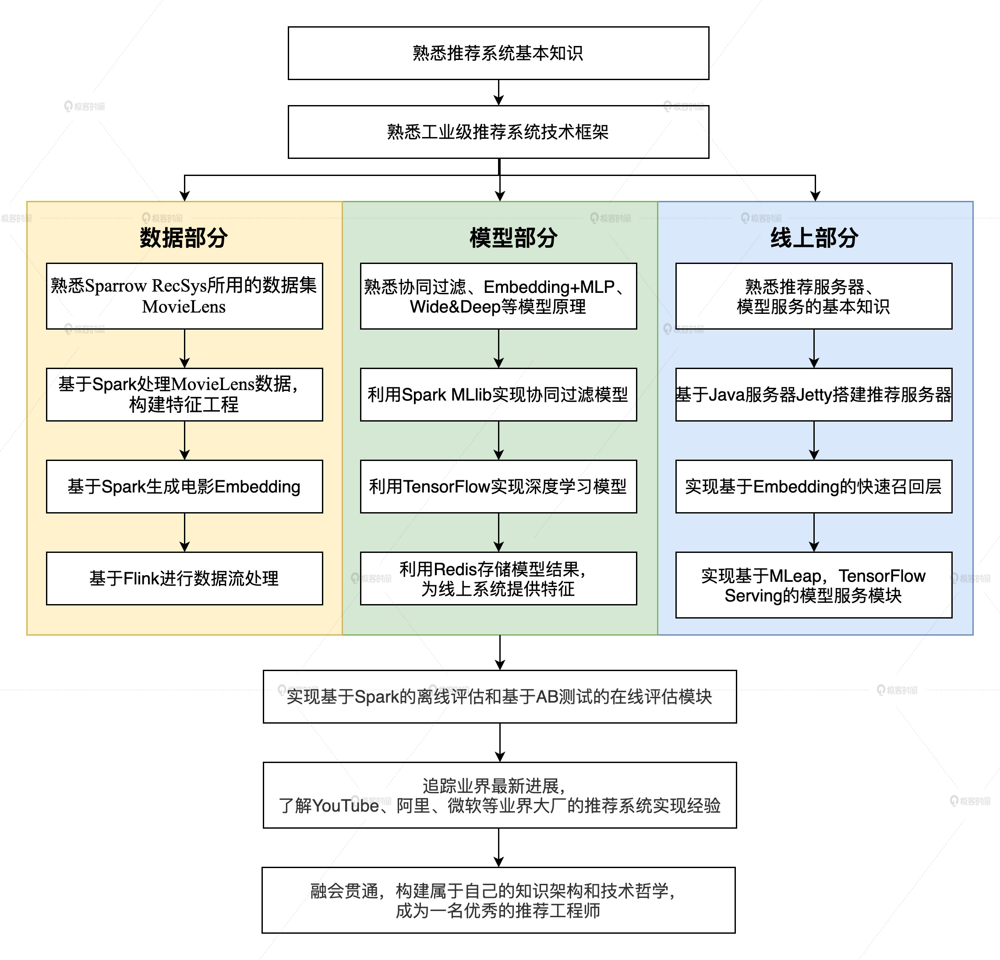

## 深度学习推荐系统实战笔记

### 整体框架

### 推荐系统经典架构长啥样

1. 推荐系统要解决的问题

   在“信息过载”的情况下，用户如何高效获取感兴趣的信息。

   推荐系统要被处理的问题可以被形式化定义为：**对于某个用户U（User），在特定场景C（Context）下，针对海量的“物品”信息构建一个函数 ，预测用户对特定候选物品I（Item）的喜好程度，再根据喜好程度对所有候选物品进行排序，生成推荐列表的问题。**

   

2. 推荐系统逻辑架构

   

3. 推荐系统中着重需要解决的两类问题

   （1） 一类问题与数据和信息相关，即“用户信息”“物品信息”“场景信息”分别是什么？如何存储、更新和处理数据？

   （2） 另一类问题与推荐系统算法和模型相关，即推荐系统模型如何训练、预测，以及如何达成更好的推荐效果？

   

4. 工业级推荐系统的技术架构